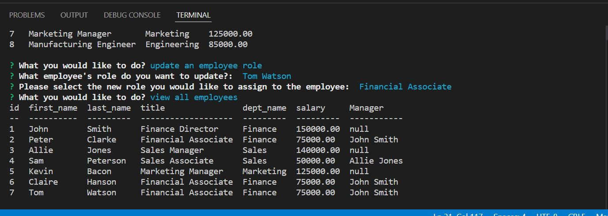

# Employee_Tracker

This application utilizes the node.js package inquirer as well as mysql databases to allow a user to manage databases containing employee and job related information.  The application uses three separate tables within the database: a department table, a job role table, and an employee table.  

When the application is in use, the user has the ability to view any of the 3 above mentioned tables, add a department to the department table, add a job role to the job roles table, add an employee to the employee table, and update an employee's role.  The user is able to select how they would like to proceed in the application, as well as entering inputs for the associated functions, through the use of inquirer prombpts.

## Application Functionality
```md
GIVEN a command-line application that accepts user input
WHEN I start the application
THEN I am presented with the following options: view all departments, view all roles, view all employees, add a department, add a role, add an employee, and update an employee role
WHEN I choose to view all departments
THEN I am presented with a formatted table showing department names and department ids
WHEN I choose to view all roles
THEN I am presented with the job title, role id, the department that role belongs to, and the salary for that role
WHEN I choose to view all employees
THEN I am presented with a formatted table showing employee data, including employee ids, first names, last names, job titles, departments, salaries, and managers that the employees report to
WHEN I choose to add a department
THEN I am prompted to enter the name of the department and that department is added to the database
WHEN I choose to add a role
THEN I am prompted to enter the name, salary, and department for the role and that role is added to the database
WHEN I choose to add an employee
THEN I am prompted to enter the employee’s first name, last name, role, and manager, and that employee is added to the database
WHEN I choose to update an employee role
THEN I am prompted to select an employee to update and their new role and this information is updated in the database 
```
# Application Video

The following video shows the application being used from the command line. Click on image to launch video:

[](https://drive.google.com/file/d/1YdH_wlA-mMjpqsBBVS0a5DMqOGcLGC4a/view)

## Github Repo

The application repository can be found at the following location: [Github_Repo](https://github.com/BMavetz/Employee_Tracker).


